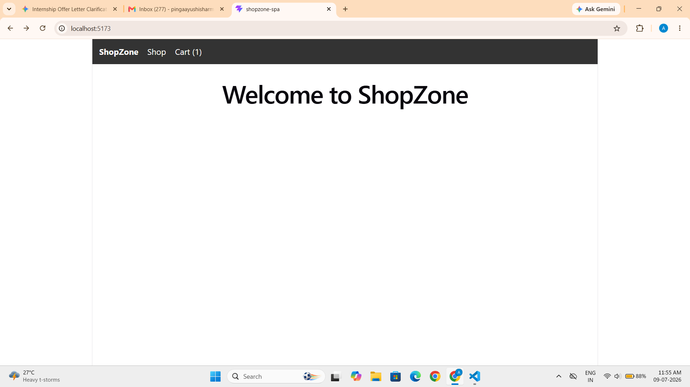
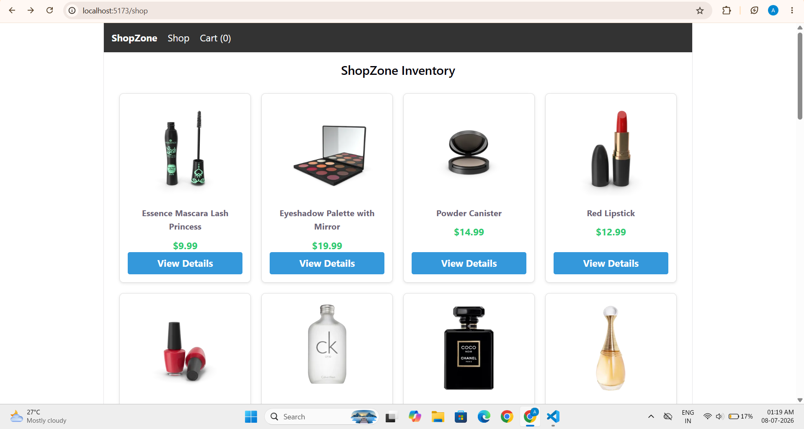
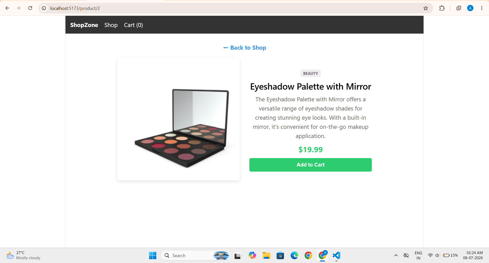
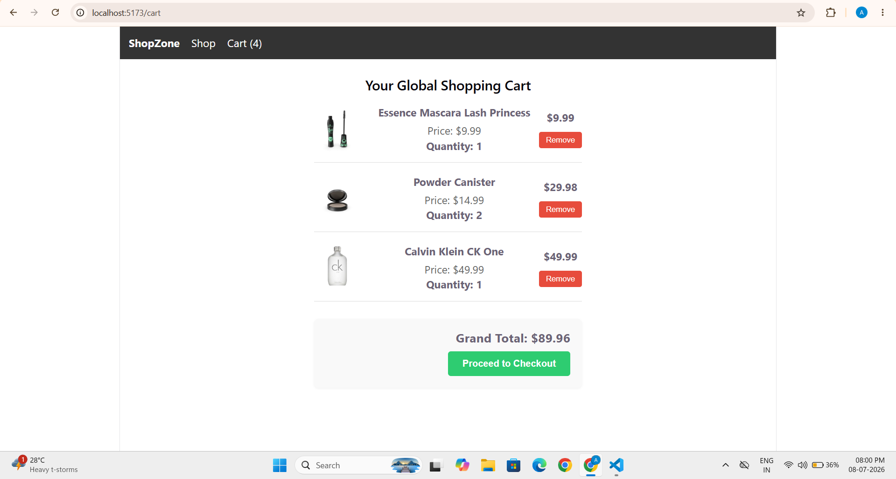

# ShopZone - Single Page Application

An enterprise-ready, state-driven e-commerce application built with React.js and integrated with dynamic routing and global context architecture.

---

## 🛠️ Tech Stack

| Component | Technology | Description |
| :--- | :--- | :--- |
| **Frontend Framework** | React.js (Vite) | Core application architecture and component ecosystem. |
| **Routing** | React Router DOM | Client-side declarative routing system. |
| **State Management** | React Context API | Global cart management and computations without Redux. |
| **Data Source** | DummyJSON API | Production REST API for real-time inventory management. |

---

## 📂 Project Architecture

```text
shopzone-spa/
├── public/
├── src/
│   ├── App.css
│   ├── App.jsx
│   ├── Cart.jsx
│   ├── CartContext.jsx
│   ├── Home.jsx
│   ├── Navbar.jsx
│   ├── ProductDetail.jsx
│   ├── Shop.jsx
│   ├── index.css
│   └── main.jsx
├── package.json
└── README.md
```

---

## 🚀Key Modules & Scope Covered (Phase 1 & Phase 2)

## 1. Base Routing Architecture
Standard dynamic path matching configured using react-router-dom.

Persisted responsive application header containing core page paths.

Zero-refresh page transition links natively driving state preservation.

## 2. Live Inventory Consumption
Component mounts hook triggers data ingestion from the /products REST endpoint.

Responsive visual rendering grid tracking multi-row layout structures.

Dynamic details dynamic path mapping via useParams context hooks.

## 3. Global Context State System
Clean root-level wrapper pattern executing standalone global state tracking.

Dynamic functional computations computing dynamic pricing summaries.

Conditional presentation interfaces checking live collection arrays.

---

## 💻 Installation & Local Setup

Execute the following sequential terminal commands to replicate the development configuration:
## 1. Clone the version control repository
git clone <repository-url>

## 2. Access the project root environment
cd shopzone-spa

## 3. Provision local dependencies
npm install

## 4. Initiate the development pipeline
npm run dev

---

## 📷 System Screenshots

### 1. Application Landing Welcome Interface


---

### 2. Live Inventory Display & Catalog Grid


---

### 3. Dynamic Product Specification & Context Detail View


---

### 4. Global State Computation & Shopping Cart Matrix


---

## 🔗 Live Demo
**View the site live here:** [https://shopzone-spa-mu.vercel.app/]

---
